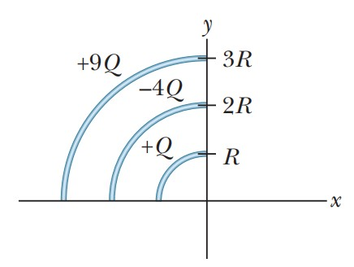

# Campo Eléctrico de arco circular

**Fuente/Autor:**  *Resnick - Fundamentos de Fisica*

## Enunciado
La figura muestra tres arcos circulares centrados en el origen de un sistema de coordenadas. En cada arco, la carga distribuida uniformemente está dada en términos de $Q = 2\,\mu C$. Los radios están dados en términos de $R = 10\,cm$. ?¿Cuales son la a) magnitud y b) dirección (relativa al eje X positivo) del campo eléctrico neto en el origen debido a los arcos?

  

## Solucion

### 1. Estrategia
Encontraremos una ecuación para el campo eléctrico causado por un arco de círculo en su centro. Dividimos la carga en elementos infinitesimales, planteamos y resolvemos una integral.

### 2. Planteo y solución de la integral
Sea $dq$ el elemento diferencial de carga, $\alpha$ el ángulo formado por dq, el origen y el eje $X$, $r$ la distancia del elemento $dq$ al origen y $\theta$, el ángulo total que subtiende el arco de círculo en el origen.

El campo eléctrico neto sería la suma de todos los elementos $dq$

$$
E = \int_{0}^{\theta/2} k\frac{dq}{r^2}\,cos\alpha
$$

Ya que el radio $r$ y $k$ son constantes los sacamos de la integral

$$
E = \frac{2k}{r^2}\;\int_{0}^{\theta/2} dq\,cos\alpha
$$

Ya que la carga es proporcional al ángulo $\alpha$

$$
E = \frac{2kQ}{\theta r^2}\;\int_{0}^{\theta/2} cos\alpha\,d\alpha
$$

Resolviendo y evaluando

$$
E = \frac{2kQ}{\theta r^2}\;\left[ sen\alpha \right]_0^{\theta/2}
$$

$$
E = \frac{2k}{\theta}\;\frac{Q}{r^2}\,sen\frac{\theta}{2}
$$

### 3. Caso particular 
Para nuestro ejercicio el ángulo $\theta$ es igual a $\pi/2$, por tanto su fórmula es:

$$
E = \frac{2k}{\pi/2}\;\frac{Q}{r^2}\,sen\frac{\pi}{4}
$$

$$
E = \frac{2\sqrt{2}k}{\pi}\;\frac{Q}{r^2}
$$

### 4. Aplicación de la fórmula a nuestro caso
La fórmula encontrada nos sirve para calcular los campos generados por los 3 arcos de círculo, siendo el neto la suma de los tres.

$$
E = \frac{2\sqrt{2}k}{\pi}\;\left( \frac{Q}{R^2} - \frac{4Q}{4R^2} + \frac{9Q}{9R^2} \right)
$$

$$
E = \frac{2\sqrt{2}k}{\pi}\;\frac{Q}{R^2}
$$

Sustituyendo los valores para la carga y el radio obtenemos

$$
E = 1.62 \times 10^6 \, N/C
$$

## Solución en Geogebra

<iframe src="https://www.geogebra.org/calculator/wg2dj6eb?embed" width="800" height="600" allowfullscreen style="border: 1px solid #e4e4e4;border-radius: 4px;" frameborder="0"></iframe>

## Problemas relacionados
- [[sears-zemansky-21.84| Angulo de apertura]]
- [[savchenko-6.1.8| Cuatro cargas formando un rombo]]