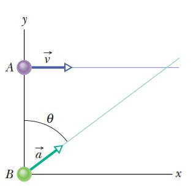

# Choque en movimiento acelerado

**Fuente/Autor:**  *Resnick - Fundamentos de Fisica*

## Enunciado
En la figura, la partícula A se mueve a lo largo de la recta $y=30 \, m$ con velocidad constante $\vec{v}$ de magnitud $3.0\, m/s$ y paralelo al eje X. En el instante que la partícula A pasa el eje Y, la partícula B sale del origen velocidad inicial cero y aceleración constante $\vec{a}$ de magnitud $0.40\,m/s^2$. ¿Qué ángulo $\theta$ entre $\vec{a}$ y la dirección positiva del eje Y resultará en una colisión?

  

## Solucion

### 1. Estrategia
Encontraremos cuanto tiempo tarda la partícula B en llegar a la línea $l = 30 \,m$ en funcion del ángulo $\theta$, en ese tiempo ambas partículas deben estar en el mismo valor de X.

### 2. Tiempo

## Solución en Geogebra
En la animación se puede ver que las particulas colisionan con el ángulo $\theta$ encontrado.

<iframe src="https://www.geogebra.org/calculator/wthjbfgc?embed" width="800" height="600" allowfullscreen style="border: 1px solid #e4e4e4;border-radius: 4px;" frameborder="0"></iframe>

## Problemas relacionados
- [[sears-zemansky-21.84| Angulo de apertura]]
- [[savchenko-6.1.8| Cuatro cargas formando un rombo]]