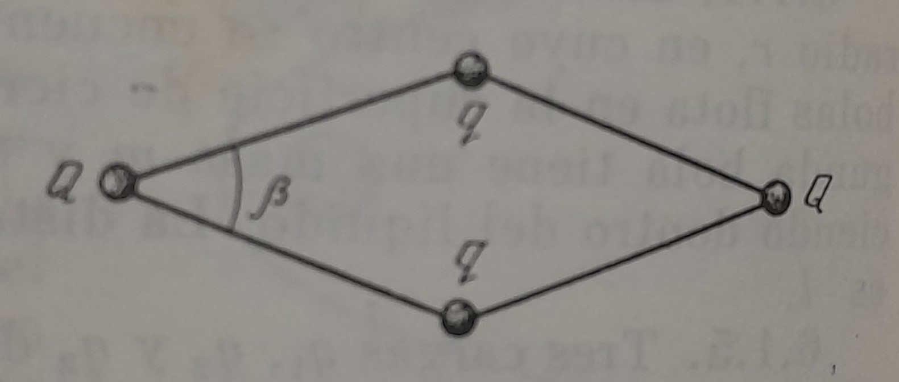

# Cuatro cargas formando un rombo

**Fuente/Autor:**  *Savchenko - Problemas de Fisica*

## Enunciado
Cuatro cargas $Q, q, Q, q$ se unen mediante cuatro hilos de longitud $l$ de la manera expuesta en la figura. Determínense los ángulos $\beta$ entre los hilos.

  

## Solucion

### 1. Estrategia
Haremos un diagrama de cuerpo libre (DCL) para la carga $q$ y otro para la carga $Q$, de esas ecuaciones encontraremos $\beta$

### 2. Condición de Equilibrio. Simetría. Ley de Coulomb.
Debido a la simetría de las cargas podemos asumir que las tensiones en los hilos son iguales y llamarles $T$. La fuerza neta en q y en Q debe ser cero.

En la carga $q$:

$$
\sum F_y = 0
$$

Aplicando la ley de Coulomb $F=k\frac{q_1q_2}{r^2}$
$$
(1)\quad 2k\frac{qQ}{l^2}\,sen\frac{\beta}{2} + k\frac{q^2}{4l^2\,sen^2\frac{\beta}{2}} = 2T\,sen\frac{\beta}{2}
$$

De forma similar para la carga $Q$

$$
\sum F_x = 0
$$

$$
(2) \quad 2k\frac{qQ}{l^2}\,cos\frac{\beta}{2} + k\frac{Q^2}{4l^2\,cos^2\frac{\beta}{2}} = 2T\,cos\frac{\beta}{2}
$$

### 3. Desarrollo algebraico. Despeje.
Reordenando las ecuaciones (1) y (2)

$$
(1) \quad k\frac{q^2}{4l^2\,sen^2\frac{\beta}{2}} = 2T\,sen\frac{\beta}{2} - 2k\frac{qQ}{l^2}\,sen\frac{\beta}{2}
$$

$$
(2) \quad k\frac{Q^2}{4l^2\,cos^2\frac{\beta}{2}} = 2T\,cos\frac{\beta}{2} - 2k\frac{qQ}{l^2}\,cos\frac{\beta}{2}
$$

Factorizando

$$
(1) \quad k\frac{q^2}{4l^2\,sen^2\frac{\beta}{2}} = 2sen\frac{\beta}{2} \left(T - k\frac{qQ}{l^2} \right)
$$

$$
(2) \quad k\frac{Q^2}{4l^2\,cos^2\frac{\beta}{2}} = 2cos\frac{\beta}{2} \left(T - k\frac{qQ}{l^2} \right)
$$

Dividiendo (1) entre (2)

$$
\frac{q^2\,cos^2\frac{\beta}{2}}{Q^2\,sen^2\frac{\beta}{2}} = \frac{sen\frac{\beta}{2}}{cos\frac{\beta}{2}}
$$

$$
tan^3\frac{\beta}{2} = \frac{q^2}{Q^2}
$$

Finalmente

$$
\beta = 2tan^{-1}\left[\left(\frac{q}{Q}\right)^{2/3}\right]
$$

### 4. Calculo de las tensiones
Despejando la tension de (1) y de (2)

$$
T = \frac{k}{l^2}\left(\frac{q^2}{sen^3\frac{\beta}{2}} + qQ \right)
$$

$$
T = \frac{k}{l^2}\left(\frac{Q^2}{cos^3\frac{\beta}{2}} + qQ \right)
$$

Usando identidades trigonométricas se puede reemplazar seno y coseno

$$
tan\frac{\beta}{2} = \left( \frac{q}{Q} \right)^\frac{2}{3}
$$

$$
sec^3\frac{\beta}{2} = \left[ 1 + \left( \frac{q}{Q} \right)^\frac{4}{3} \right]^\frac{3}{2}
$$

$$
sec^3\frac{\beta}{2} = \frac{(Q^{4/3} + q^{4/3})^{3/2}}{Q^2}
$$

Sustituyendo obtenemos la tensión

$$
T = \frac{k}{l^2}\left[ \frac{(Q^{4/3} + q^{4/3})^{3/2}}{8} + qQ \right]
$$

Se obtiene el mismo resultado para $T$ si usamos cosecante en lugar de secante.

## Solución en Geogebra

<iframe src="https://www.geogebra.org/calculator/qanfe74t?embed" width="800" height="600" allowfullscreen style="border: 1px solid #e4e4e4;border-radius: 4px;" frameborder="0"></iframe>

## Problemas relacionados
- [[sears-zemansky-21.84| Angulo de apertura]]
