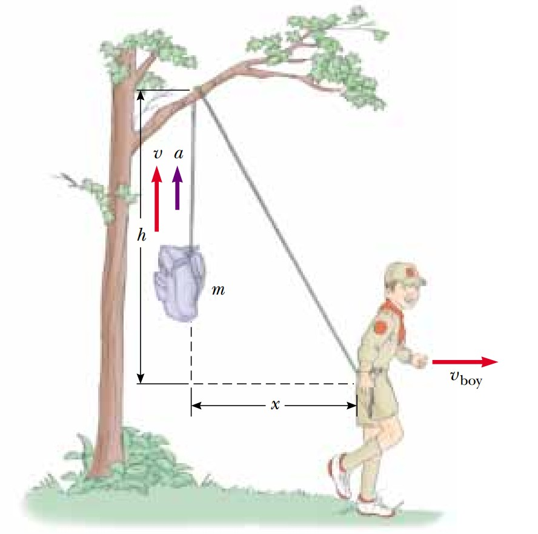

# Boy scout

**Fuente/Autor:**  *Serway - Física para científicos e ingenieros*

## Enunciado
Para proteger su comida de osos hambrientos, un boy scout eleva su paquete de comida con una cuerda que es lanzada sobre la rama de un árbol a una altura $h$ relativa a sus manos. a) Muestre que la velocidad $v$ del paquete de comida está dado por $x(x^2+h^2)^{-1/2}\,v_{boy}$ donde $x$ es la distancia que se ha alejado de la cuerda vertical. b) Muestre que la aceleración $a$ del paquete de comida es $h^2(x^2+h^2)^{-3/2}\,v^2_{boy}$. c) ¿Qué valores tienen la aceleración $a$ y velocidad $v$ tienen justo después que él se aleja del punto bajo el paquete $(x=0)$? d) ¿A qué valores se aproximan la velocidad y aceleración del paquete a medida que la distancia $x$ aumenta? 

  

### 1. Estrategia
Establecemos la relación Pitagórica entre $x$ y $r$, la hipotenusa del triángulo formado. Asumimos que la cuerda es inextensible y derivamos implícitamente para encontrar la velocidad $v$, a partir de $v$, derivamos nuevamente para encontar la aceleración $a$. Con estas expresiones es fácil contestar los incisos restantes.

### 2. Relación Pitagórica
La altura $h$, la distancia $x$ y la cuerda $r$ (de la rama al boy scout) forman un triángulo rectángulo, por lo tanto se cumple que

$$
x^2 + h^2 = r^2
$$

Derivando implícitamente respecto al tiempo obtenemos

$$
2x\frac{dx}{dt} + 0 = 2r\frac{dr}{dt}
$$

Note que $h$ es constante. Simplificando obtenemos

$$
\frac{dr}{dt} = \frac{x}{r} \, \frac{dx}{dt}
$$

Observe que $\frac{dx}{dt} = v_{boy}$ y $\frac{dr}{dt} = v$

Además por el Teorema de Pitágoras $r = (x^2 + h^2)^{1/2}$

Por lo tanto,

$$
v = x(x^2 + h^2)^{-1/2}\,v_{boy}
$$

### 3. Aceleración
Para encontrar la aceleración $a$, derivamos $v$ respecto al tiempo $t$

$$
a = \frac{dv}{dt}= \frac{d}{dt} \left[ x(x^2 + h^2)^{-1/2}\,v_{boy} \right]
$$

Usamos la regla del producto y notamos que $v_{boy}$ es constante

$$
a = \left[ \frac{dx}{dt}(x^2 + h^2)^{-1/2} - \frac{1}{2}x(x^2 + h^2)^{-3/2} \, 2x\, \frac{dx}{dt} \right]
$$

Simplificamos obtenemos $a$

$$
a = h^2(x^2 + h^2)^{-3/2} \, v^2_{boy}
$$

### 4. Casos especiales

Cuando $x=0$ la aceleración es

$$
a = h^2(h^2)^{-3/2} \, v^2_{boy} = \frac{v^2_{boy}}{h}
$$

y la velocidad es

$$
v = 0(0^2 + h^2)^{-1/2}\,v_{boy} = 0
$$

Cuando $x \to \infty$ la velocidad tiende a

$$
v =\lim_{x \to \infty} x(x^2 + h^2)^{-1/2}\,v_{boy} = v_{boy}
$$

y la aceleración tiende a 

$$
a = \lim_{x \to \infty} h^2(x^2 + h^2)^{-3/2} \, v^2_{boy}
$$

$$
a = \lim_{x \to \infty} \frac{h^2 v^2_{boy}}{x^3} = 0
$$

## Solución en GeoGebra
